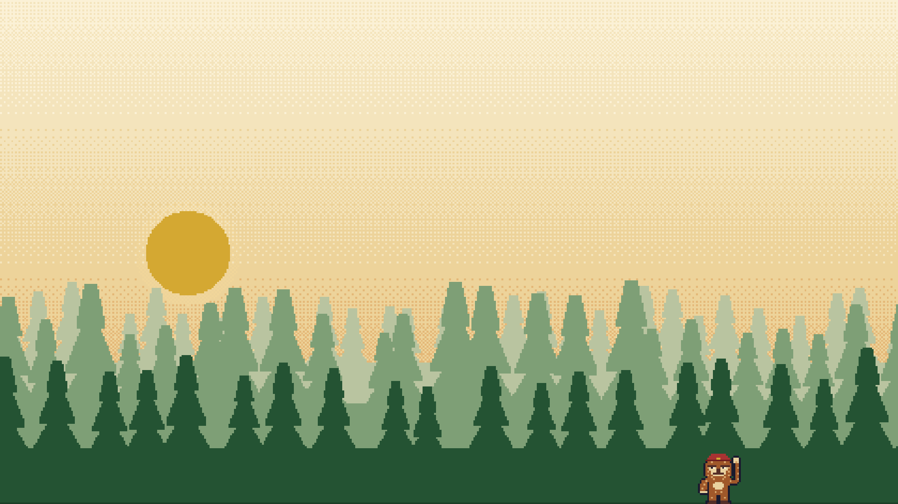
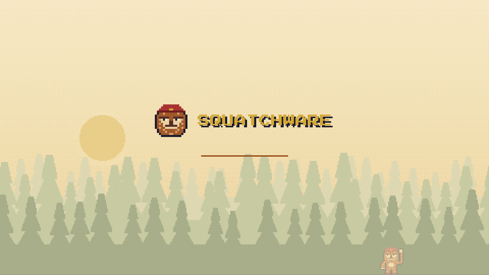

# Squatchware Light for Omarchy

The daylight half of the [Squatchware](https://squatchware.dev) Omarchy theme: parchment,
forest ink and campfire orange, with the squatch waving from the pines at dawn.




```sh
omarchy theme install https://github.com/squatchware/omarchy-squatchware-light-theme
```

- `01-sighting.png`: dawn over the pines, with the squatch at the edge of the trees
- `02-treeline.png`: the same forest with nobody in it (or so it seems)
- `unlock.png`: the lock-screen logo, and the boot splash via `omarchy plymouth set by theme squatchware-light`
- `screensaver.txt`: the screensaver art

The dark theme, the Limine boot menu and the screensaver hook live in
[omarchy-squatchware-theme](https://github.com/squatchware/omarchy-squatchware-theme); its
`extras/install-extras.sh` sets them up for both variants. This repo is generated by that
repo's `src/build.py`, so change things there.

Press Start 2P is by CodeMan38, SIL Open Font License.
